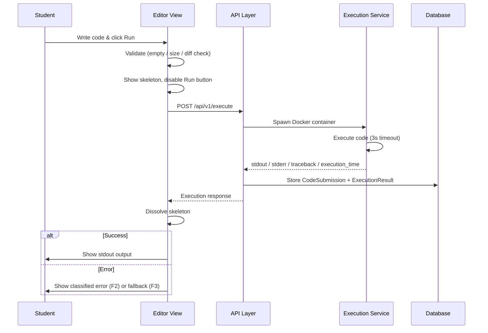
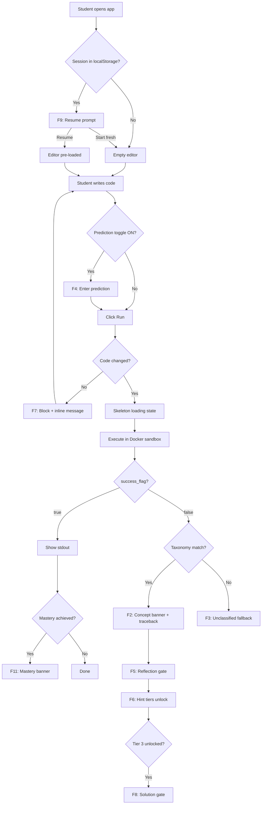

# Core Flows — Beginner Cognitive Debugger

# Core Flows — Beginner Cognitive Debugger

## Document Purpose

This spec defines every user-facing interaction flow across all three sprints. It is the authoritative reference for what happens step-by-step from the student's perspective — including UI states, system decisions, branching conditions, and feedback. Implementation must not deviate from these flows without updating this document first.

---

## Flow Index

| Flow | Sprint | Description |
|---|---|---|
| F1 — Code Submission & Execution | Sprint 1 | Student submits code, sandbox runs it, output or error is displayed |
| F2 — Error Output & Classification | Sprint 1 | Classified error is rendered with pedagogical signal first |
| F3 — Unclassified Error Fallback | Sprint 1 | Error type not in taxonomy — graceful degradation |
| F4 — Prediction Toggle | Sprint 2 | Student predicts output before running |
| F5 — Reflection Gate & Hint Unlock | Sprint 2 | Reflection required before hints are accessible |
| F6 — Hint Tier Progression | Sprint 2 | Three-tier hint system, locked until earned |
| F7 — Re-execution Restriction | Sprint 2 | Code must change before re-run is permitted |
| F8 — Solution Gate | Sprint 2 | Full solution revealed only after 3 explicit requests |
| F9 — Session Resume | Sprint 3 | Returning student is prompted to resume or start fresh |
| F10 — Learning Analytics Dashboard | Sprint 3 | Student navigates to their mastery profile |
| F11 — Mastery Achievement Moment | Sprint 3 | Concept mastery is celebrated inline |

---

## Global UI Structure

The application has two primary views accessible via top navigation:

- **Editor View** — the active debugging workspace (default landing)
- **My Progress** — the dedicated analytics dashboard (Sprint 3)

Anonymous `session_id` (client-generated UUID) is stored in `localStorage` and sent with every request in Sprint 1. Authentication is not part of any sprint in this document's scope.

---

## F1 — Code Submission & Execution (Sprint 1)

### Entry State
Student lands on the Editor View. The Monaco Editor is focused and empty (or pre-loaded from a resumed session — see F9).

### Step-by-Step

1. **Student writes Python code** in the Monaco Editor.
2. **Student clicks the Run button** in the editor toolbar.
3. **System validates the submission:**
   - If code is empty → inline validation message: `"Write some code before running."` Run is blocked.
   - If code exceeds 10KB → inline validation message: `"Code is too long. Keep it under 10KB."` Run is blocked.
   - If code is identical to the previous submission → redirect to F7 (Re-execution Restriction).
4. **Loading state activates:**
   - Run button becomes disabled (greyed, non-clickable).
   - Output panel displays an animated skeleton placeholder (pulsing grey bars representing lines of output).
   - No spinner text — the skeleton communicates activity visually.
5. **Backend receives** `POST /api/v1/execute` with `{ code, language: "python", session_id }`.
6. **Execution Service** spawns an ephemeral Docker container, runs the code with:
   - CPU limit enforced
   - Memory limit enforced
   - 3-second timeout (on timeout → `EXEC_TIMEOUT` error code returned)
   - No shell access, no filesystem write access
7. **Container result returned** to API Layer → `stdout`, `stderr`, `traceback`, `execution_time`, `success_flag`.
8. **Skeleton dissolves** → output panel renders:
   - **On success:** stdout displayed in the output panel. Run button re-enables. Go to F11 if mastery conditions are met (Sprint 3).
   - **On error:** go to F2 (classified) or F3 (unclassified).

### Timeout Handling
If container does not return within 3 seconds, the API returns `{ code: "EXEC_TIMEOUT" }`.
Output panel renders: `"Execution timed out after 3 seconds. Check for infinite loops or long-running operations."` — styled as an error, not a traceback.

### Sequence Diagram



### Editor View Wireframe

```wireframe
<!DOCTYPE html>
<html>
<head>
<style>
* { box-sizing: border-box; margin: 0; padding: 0; font-family: system-ui, sans-serif; }
body { background: #f5f5f5; min-height: 100vh; }
.topnav { display: flex; align-items: center; justify-content: space-between; background: #1e1e2e; color: #fff; padding: 10px 20px; }
.topnav .brand { font-weight: 700; font-size: 15px; letter-spacing: 0.5px; }
.topnav .nav-links { display: flex; gap: 24px; font-size: 13px; }
.topnav .nav-links a { color: #cdd6f4; text-decoration: none; }
.topnav .nav-links a.active { color: #89b4fa; border-bottom: 2px solid #89b4fa; padding-bottom: 2px; }
.layout { display: flex; height: calc(100vh - 48px); }
.editor-panel { flex: 1; display: flex; flex-direction: column; border-right: 1px solid #ddd; background: #fff; }
.toolbar { display: flex; align-items: center; gap: 12px; padding: 8px 14px; background: #f0f0f0; border-bottom: 1px solid #ddd; }
.toolbar-label { font-size: 12px; color: #555; font-weight: 600; }
.toggle-wrap { display: flex; align-items: center; gap: 6px; font-size: 12px; color: #444; }
.toggle { width: 32px; height: 18px; background: #ccc; border-radius: 9px; position: relative; cursor: pointer; }
.toggle-knob { width: 14px; height: 14px; background: #fff; border-radius: 50%; position: absolute; top: 2px; left: 2px; }
.run-btn { margin-left: auto; background: #1a7f4e; color: #fff; border: none; border-radius: 5px; padding: 7px 18px; font-size: 13px; font-weight: 600; cursor: pointer; }
.run-btn:disabled { background: #aaa; cursor: not-allowed; }
.code-area { flex: 1; background: #1e1e2e; color: #cdd6f4; font-family: monospace; font-size: 13px; padding: 16px; overflow: auto; border: none; resize: none; width: 100%; }
.output-panel { width: 380px; display: flex; flex-direction: column; background: #fafafa; }
.output-header { padding: 10px 14px; font-size: 12px; font-weight: 700; color: #333; background: #f0f0f0; border-bottom: 1px solid #ddd; text-transform: uppercase; letter-spacing: 0.5px; }
.output-body { flex: 1; padding: 14px; overflow: auto; }
.skeleton-line { background: #e0e0e0; border-radius: 4px; height: 13px; margin-bottom: 10px; animation: pulse 1.4s ease-in-out infinite; }
.skeleton-line.w80 { width: 80%; }
.skeleton-line.w60 { width: 60%; }
.skeleton-line.w90 { width: 90%; }
@keyframes pulse { 0%,100%{opacity:1} 50%{opacity:0.4} }
.status-bar { padding: 6px 14px; font-size: 11px; color: #888; border-top: 1px solid #eee; background: #f5f5f5; }
</style>
</head>
<body>
<div class="topnav">
  <span class="brand">🐛 CogDebug</span>
  <div class="nav-links">
    <a href="#" class="active">Editor</a>
    <a href="#">My Progress</a>
  </div>
</div>
<div class="layout">
  <div class="editor-panel">
    <div class="toolbar">
      <span class="toolbar-label">Python</span>
      <div class="toggle-wrap">
        <span>Predict before run</span>
        <div class="toggle"><div class="toggle-knob"></div></div>
      </div>
      <button class="run-btn" disabled>Running…</button>
    </div>
    <textarea class="code-area" placeholder="# Write your Python code here...">print(x)</textarea>
    <div class="status-bar">Line 1, Col 9 · session: anon-uuid</div>
  </div>
  <div class="output-panel">
    <div class="output-header">Output</div>
    <div class="output-body">
      <div class="skeleton-line w80"></div>
      <div class="skeleton-line w60"></div>
      <div class="skeleton-line w90"></div>
      <div class="skeleton-line w70" style="width:70%"></div>
    </div>
  </div>
</div>
</body>
</html>
```

---

## F2 — Error Output & Classification (Sprint 1)

### Trigger
`ExecutionResult.success_flag = false` AND exception type exists in the taxonomy table (NameError, TypeError, IndexError, KeyError).

### Cognitive Engine Processing (Internal)
The Cognitive Engine receives the traceback and:
1. Extracts exception type, message, and line number from the traceback string.
2. Looks up exception type in `ConceptCategory` taxonomy table.
3. Returns: `exception_type`, `concept_category`, `misconception_hypothesis`.

### Output Panel Layout — Pedagogical Signal First

The output panel renders in this strict visual order:

**1. Concept Category Banner (top, prominent)**
A coloured badge strip showing:
- Concept category name (e.g. `Variable Initialization`)
- Short label: `"Variable Initialization error detected"`
- Cognitive skill context (e.g. `"State awareness"`)

**2. Traceback Disclosure Section (collapsed by default)**
A clickable `▶ Show traceback` toggle.
When expanded, shows the raw Python traceback in a monospace block — exactly as Python outputs it, line numbers preserved.

**3. Sprint 2 cognitive signals appear here** (not rendered in Sprint 1): guided question, reflection input, hint tiers. The output panel must be designed with vertical space reserved for these below the traceback toggle.

### Error Panel Wireframe

```wireframe
<!DOCTYPE html>
<html>
<head>
<style>
* { box-sizing: border-box; margin: 0; padding: 0; font-family: system-ui, sans-serif; }
body { background: #fafafa; padding: 0; }
.output-panel { width: 380px; display: flex; flex-direction: column; height: 100vh; }
.output-header { padding: 10px 14px; font-size: 12px; font-weight: 700; color: #333; background: #f0f0f0; border-bottom: 1px solid #ddd; text-transform: uppercase; letter-spacing: 0.5px; }
.output-body { flex: 1; padding: 14px; overflow: auto; display: flex; flex-direction: column; gap: 12px; }
.concept-banner { background: #fff3cd; border: 1.5px solid #f0a500; border-radius: 8px; padding: 12px 14px; }
.concept-tag { display: inline-block; background: #f0a500; color: #fff; font-size: 11px; font-weight: 700; border-radius: 3px; padding: 2px 8px; letter-spacing: 0.5px; margin-bottom: 6px; text-transform: uppercase; }
.concept-title { font-size: 15px; font-weight: 700; color: #7a5200; margin-bottom: 3px; }
.concept-sub { font-size: 12px; color: #9a6900; }
.traceback-toggle { display: flex; align-items: center; gap: 6px; font-size: 12px; color: #555; cursor: pointer; padding: 6px 0; border: none; background: none; font-family: inherit; }
.traceback-toggle .arrow { font-size: 10px; }
.traceback-block { background: #1e1e2e; color: #f38ba8; font-family: monospace; font-size: 12px; border-radius: 6px; padding: 12px; line-height: 1.6; white-space: pre-wrap; display: none; }
.traceback-block.open { display: block; }
.hint-section-placeholder { border: 1.5px dashed #ddd; border-radius: 8px; padding: 12px 14px; text-align: center; color: #bbb; font-size: 12px; }
</style>
</head>
<body>
<div class="output-panel">
  <div class="output-header">Output</div>
  <div class="output-body">
    <div class="concept-banner">
      <span class="concept-tag">Variable Initialization</span>
      <div class="concept-title">Variable Initialization error detected</div>
      <div class="concept-sub">Skill area: State awareness</div>
    </div>
    <button class="traceback-toggle" onclick="this.nextElementSibling.classList.toggle('open'); this.querySelector('.arrow').textContent = this.nextElementSibling.classList.contains('open') ? '▼' : '▶'">
      <span class="arrow">▶</span> Show traceback
    </button>
    <div class="traceback-block">Traceback (most recent call last):
  File "main.py", line 1, in &lt;module&gt;
    print(x)
NameError: name 'x' is not defined</div>
    <div class="hint-section-placeholder">Guided question &amp; hints appear here (Sprint 2)</div>
  </div>
</div>
</body>
</html>
```

---

## F3 — Unclassified Error Fallback (Sprint 1)

### Trigger
`ExecutionResult.success_flag = false` AND exception type is NOT in the taxonomy table.

### Output Panel Rendering

No concept banner. No hint indicators. The output panel renders:

1. **Raw traceback** — displayed directly in a monospace block (not collapsed, since there is no pedagogical layer to foreground).
2. **System prompt below the traceback:**
   > `"This error type isn't in our system yet. Read the traceback carefully."`
   
   Styled as a neutral informational note, not an error. Does not imply the system failed.

---

## F4 — Prediction Toggle (Sprint 2)

### UI Location
A persistent toggle switch sits in the **editor toolbar**, always visible alongside the Python language label and Run button. Default state: **OFF**.

### OFF State (default)
Toggle is grey. No prediction input is shown. Student clicks Run normally → goes to F1.

### ON State
Student flips the toggle to ON (toggle turns blue/active). A text input field **appears between the editor and the Run button area** (or as an inline prompt section below the toolbar):

> Label: `"What do you expect this code to output?"`  
> Textarea: multi-line, placeholder: `"Describe your expected output…"`  
> The Run button remains active — prediction is not mandatory, but the field must be visible.

When student clicks Run:
- If prediction text is present → stored as `prediction` field in `CodeSubmission`.
- If prediction text is empty and toggle is ON → Run proceeds; prediction stored as `null`.

### Post-Execution (when prediction was submitted)
After output is rendered, a comparison note appears in the output panel (below the output/error):
> `"Your prediction: [student's text]"` — displayed in a subtle quote block. No automatic scoring in MVP.

---

## F5 — Reflection Gate & Hint Unlock (Sprint 2)

### Trigger
An error occurs AND the error is classified (taxonomy match found). The Cognitive Engine generates:
- A **guided reflective question** (rule-based, mapped from concept category)
- A **Tier 1 hint** (pre-written, stored in `HintSequence`)

### Reflection Input UI
Appears in the output panel **directly below the concept banner**, before the traceback toggle and hint tiers:

> **Guided question** (bold, prominent):  
> e.g. `"Where do you think the variable x should have been created?"`

> **Reflection textarea:**  
> Placeholder: `"Type your thoughts here…"` — required to have at least 1 character before submit.

> **Submit Reflection button**

On submission:
- `ReflectionResponse` is stored in DB, linked to the `CodeSubmission`.
- API returns `{ accepted: true, next_hint_unlocked: true }`.
- Hint Tier 1 unlocks immediately.
- The reflection textarea becomes read-only (submission is final for this error instance).

### Auto-unlock Condition (FR13 second path)
If the student submits **two more code attempts** (both resulting in errors) without submitting a reflection, the system automatically unlocks Tier 1:
- A note appears: `"Hint unlocked after multiple attempts."` — no reflection required retroactively.

---

## F6 — Hint Tier Progression (Sprint 2)

### Visual Layout
Three hint tiers are always visible in the output panel below the reflection section. They are shown as a vertical list with clear tier labels. **All three tiers are rendered immediately** when an error is classified — not hidden.

### Locked State
Tiers not yet earned display:
- Grey background, lock icon 🔒
- Tier label (e.g. `"Hint 2 — Directional"`)
- Subtext: `"Submit a reflection to unlock"` (or `"Unlock Hint 1 first"` for Tiers 2 and 3)
- Content is NOT shown — only the label and unlock requirement

### Unlocked State
- Background becomes white/light
- Lock icon replaced by tier label badge
- Hint text is fully visible
- A subtle `"Unlocked"` indicator (green dot or checkmark)

### Tier Definitions

| Tier | Name | Character | Example |
|---|---|---|---|
| 1 | Concept hint | Broad — names the concept | `"Check where variables are defined before use."` |
| 2 | Directional hint | Narrower — points toward the fix | `"Initialize the variable before calling print()."` |
| 3 | Near-solution hint | Specific — almost gives it away | `"You need to assign a value to x on a line before print(x)."` |

### Unlock Sequence
- **Tier 1** → unlocks when reflection is submitted OR two failed resubmissions occur (F5).
- **Tier 2** → unlocks when student clicks `"Get next hint"` after reading Tier 1. No additional gate.
- **Tier 3** → unlocks when student clicks `"Get next hint"` after reading Tier 2. No additional gate.
- **"Show Solution" button** → appears only after Tier 3 is unlocked (F8).

### Hint Tier Wireframe

```wireframe
<!DOCTYPE html>
<html>
<head>
<style>
* { box-sizing: border-box; margin: 0; padding: 0; font-family: system-ui, sans-serif; }
body { background: #fafafa; padding: 14px; }
.hint-section { display: flex; flex-direction: column; gap: 8px; }
.hint-card { border-radius: 7px; border: 1.5px solid #e0e0e0; padding: 11px 13px; background: #fff; }
.hint-card.locked { background: #f5f5f5; color: #aaa; }
.hint-header { display: flex; align-items: center; gap: 8px; margin-bottom: 4px; }
.hint-badge { font-size: 10px; font-weight: 700; border-radius: 3px; padding: 2px 7px; text-transform: uppercase; letter-spacing: 0.5px; }
.hint-badge.unlocked { background: #d1fae5; color: #065f46; }
.hint-badge.locked { background: #e0e0e0; color: #888; }
.hint-label { font-size: 12px; font-weight: 600; }
.hint-lock { font-size: 13px; }
.hint-text { font-size: 13px; color: #333; line-height: 1.5; }
.hint-text.locked { color: #bbb; font-style: italic; }
.hint-sublabel { font-size: 11px; color: #999; margin-top: 4px; }
.next-hint-btn { background: #3b82f6; color: #fff; border: none; border-radius: 5px; padding: 7px 14px; font-size: 12px; font-weight: 600; cursor: pointer; margin-top: 4px; width: 100%; }
.solution-btn { background: #fff; color: #ef4444; border: 1.5px solid #ef4444; border-radius: 5px; padding: 8px 14px; font-size: 12px; font-weight: 600; cursor: pointer; width: 100%; margin-top: 6px; }
</style>
</head>
<body>
<div class="hint-section">
  <div class="hint-card">
    <div class="hint-header">
      <span class="hint-badge unlocked">Hint 1</span>
      <span class="hint-label">Concept</span>
      <span style="margin-left:auto;font-size:11px;color:#065f46;">✓ Unlocked</span>
    </div>
    <div class="hint-text">Check where variables are defined before use.</div>
    <button class="next-hint-btn">Get next hint →</button>
  </div>
  <div class="hint-card locked">
    <div class="hint-header">
      <span class="hint-badge locked">Hint 2</span>
      <span class="hint-label" style="color:#aaa;">Directional</span>
      <span class="hint-lock" style="margin-left:auto;">🔒</span>
    </div>
    <div class="hint-text locked">Unlock Hint 1 first to reveal this.</div>
    <div class="hint-sublabel">Unlock Hint 1 first</div>
  </div>
  <div class="hint-card locked">
    <div class="hint-header">
      <span class="hint-badge locked">Hint 3</span>
      <span class="hint-label" style="color:#aaa;">Near-Solution</span>
      <span class="hint-lock" style="margin-left:auto;">🔒</span>
    </div>
    <div class="hint-text locked">Unlock Hint 2 first to reveal this.</div>
    <div class="hint-sublabel">Unlock Hint 2 first</div>
  </div>
</div>
</body>
</html>
```

---

## F7 — Re-execution Restriction (Sprint 2)

### Trigger
Student clicks Run and `hash(new_code) == hash(previous_submission.code)` (exact text match comparison).

### System Response
- Run is **not executed**. No container is spawned.
- Run button remains **disabled**.
- An inline message appears **immediately below the Run button** in the toolbar area:
  > `"Your code hasn't changed. Modify it before re-running."`
  
  Styled as a soft amber/warning inline note — not an error, not a dismissable toast.

- Message auto-clears as soon as the editor detects any character change (keydown event in Monaco).
- Run button re-enables once a diff is detected.

### Design Intent
This is intentional friction. The message does not suggest *what* to change. The student must think about what to modify. No hint about direction is given here.

---

## F8 — Solution Gate (Sprint 2)

### Trigger
Hint Tier 3 has been unlocked and read. A `"Show Solution"` button appears at the bottom of the hint panel.

### Gating Mechanism — 3 Explicit Confirmations

**Request 1:**  
Student clicks `"Show Solution"`.  
A modal/dialog appears:
> Title: `"Are you sure?"`  
> Body: `"Seeing the solution now means you miss the learning. Try once more?"`  
> Buttons: `[Try once more]` `[Yes, show me (1/3)]`

Student clicks `"Yes, show me (1/3)"` → dialog closes, counter incremented to 1. Button label updates: `"Show Solution (1/3 requests used)"`.

**Request 2:**  
Student clicks again.  
Dialog:
> `"Are you sure? (Request 2 of 3)"`  
> Body: `"One more attempt could be the breakthrough."`  
> Buttons: `[Keep trying]` `[Yes, show me (2/3)]`

**Request 3:**  
Student clicks again.  
Dialog:
> `"Last confirmation (Request 3 of 3)"`  
> Body: `"The solution will now be revealed."`  
> Buttons: `[Cancel]` `[Reveal solution]`

Student clicks `"Reveal solution"` → solution is rendered in the output panel below the hint tiers, in a distinct solution block (amber background, clearly labelled `"Full Solution"`).

### Counter Persistence
The request counter is stored per `CodeSubmission` — not per session. Navigating away and returning does not reset it.

---

## F9 — Session Resume (Sprint 3)

### Trigger
Student opens the application URL. The frontend checks `localStorage` for an existing `session_id`.

### Condition: Session Found
A **resume banner/dialog** appears before the editor is interactive:

> Title: `"You have an unfinished session"`  
> Body: `"Last active: [relative timestamp, e.g. '2 hours ago']"`  
> Buttons: `[Resume session]` `[Start fresh]`

**Resume session:** Editor pre-loads last `code_text`, output panel restores last `ExecutionResult` + any unlocked hints + reflection state. `Session.is_active` remains `true`.

**Start fresh:** A new `session_id` is generated client-side. Previous session is closed (`is_active = false`) in the DB. Editor is empty.

### Condition: No Session Found
No dialog. Editor loads empty. A new `session_id` is generated immediately.

### Session Resume Wireframe

```wireframe
<!DOCTYPE html>
<html>
<head>
<style>
* { box-sizing: border-box; margin: 0; padding: 0; font-family: system-ui, sans-serif; }
body { background: rgba(0,0,0,0.35); display: flex; align-items: center; justify-content: center; min-height: 100vh; }
.dialog { background: #fff; border-radius: 10px; padding: 28px 28px 22px; width: 360px; box-shadow: 0 8px 32px rgba(0,0,0,0.18); }
.dialog-icon { font-size: 26px; margin-bottom: 10px; }
.dialog-title { font-size: 17px; font-weight: 700; color: #1a1a2e; margin-bottom: 6px; }
.dialog-body { font-size: 13px; color: #555; line-height: 1.6; margin-bottom: 8px; }
.dialog-meta { font-size: 12px; color: #888; margin-bottom: 22px; }
.dialog-actions { display: flex; gap: 10px; }
.btn-primary { flex: 1; background: #1a7f4e; color: #fff; border: none; border-radius: 6px; padding: 10px; font-size: 13px; font-weight: 600; cursor: pointer; }
.btn-secondary { flex: 1; background: #fff; color: #555; border: 1.5px solid #ddd; border-radius: 6px; padding: 10px; font-size: 13px; font-weight: 600; cursor: pointer; }
</style>
</head>
<body>
<div class="dialog">
  <div class="dialog-icon">📂</div>
  <div class="dialog-title">You have an unfinished session</div>
  <div class="dialog-body">Your last session contains code and debugging progress that hasn't been resolved.</div>
  <div class="dialog-meta">Last active: 2 hours ago</div>
  <div class="dialog-actions">
    <button class="btn-primary">Resume session</button>
    <button class="btn-secondary">Start fresh</button>
  </div>
</div>
</body>
</html>
```

---

## F10 — Learning Analytics Dashboard (Sprint 3)

### Navigation
Accessible via the **"My Progress"** link in the top navigation bar. This is a **separate route** — navigating here leaves the Editor View. The editor state is preserved (session is not lost).

### Page Structure

**Section 1 — Concept Mastery Overview**
A card grid where each card represents a `ConceptCategory`. Each card shows:
- Concept name
- Mastery indicator: `Mastered` (green) / `In Progress` (yellow) / `Weakness` (red)
- Recent error count (last 10 submissions)
- Mastery progress bar (% toward next mastery threshold)

**Section 2 — Weakness Profile**
Concepts flagged as weaknesses (≥3 errors in the same concept within last 10 submissions) are listed with:
- Concept name
- Error count and pattern summary
- CTA: `"Practice this concept →"` (links back to Editor with no pre-filled code)

**Section 3 — Session History**
A searchable list of past debugging sessions:
- Session start time
- Number of submissions in that session
- Error concepts encountered
- Click to view session details (read-only replay of submission → output → hints)

### Analytics Dashboard Wireframe

```wireframe
<!DOCTYPE html>
<html>
<head>
<style>
* { box-sizing: border-box; margin: 0; padding: 0; font-family: system-ui, sans-serif; }
body { background: #f5f5f5; min-height: 100vh; }
.topnav { display: flex; align-items: center; justify-content: space-between; background: #1e1e2e; color: #fff; padding: 10px 20px; }
.topnav .brand { font-weight: 700; font-size: 15px; }
.topnav .nav-links { display: flex; gap: 24px; font-size: 13px; }
.topnav .nav-links a { color: #cdd6f4; text-decoration: none; }
.topnav .nav-links a.active { color: #89b4fa; border-bottom: 2px solid #89b4fa; padding-bottom: 2px; }
.page { max-width: 860px; margin: 0 auto; padding: 24px 20px; }
.page-title { font-size: 22px; font-weight: 700; color: #1a1a2e; margin-bottom: 4px; }
.page-sub { font-size: 13px; color: #777; margin-bottom: 24px; }
.section-title { font-size: 13px; font-weight: 700; text-transform: uppercase; letter-spacing: 0.5px; color: #555; margin-bottom: 12px; }
.card-grid { display: grid; grid-template-columns: repeat(2, 1fr); gap: 12px; margin-bottom: 28px; }
.card { background: #fff; border-radius: 8px; padding: 14px 16px; border: 1.5px solid #e0e0e0; }
.card-top { display: flex; align-items: center; justify-content: space-between; margin-bottom: 8px; }
.card-name { font-size: 14px; font-weight: 600; color: #1a1a2e; }
.badge { font-size: 10px; font-weight: 700; border-radius: 3px; padding: 2px 8px; text-transform: uppercase; }
.badge.mastered { background: #d1fae5; color: #065f46; }
.badge.progress { background: #fef9c3; color: #854d0e; }
.badge.weakness { background: #fee2e2; color: #991b1b; }
.progress-bar-wrap { background: #f0f0f0; border-radius: 4px; height: 6px; margin-bottom: 6px; }
.progress-bar { height: 6px; border-radius: 4px; }
.progress-bar.green { background: #22c55e; width: 100%; }
.progress-bar.yellow { background: #eab308; width: 60%; }
.progress-bar.red { background: #ef4444; width: 20%; }
.card-meta { font-size: 11px; color: #888; }
.weakness-section { background: #fff; border-radius: 8px; border: 1.5px solid #fca5a5; padding: 16px; margin-bottom: 28px; }
.weakness-row { display: flex; align-items: center; justify-content: space-between; padding: 8px 0; border-bottom: 1px solid #fef2f2; }
.weakness-row:last-child { border-bottom: none; }
.weakness-name { font-size: 13px; font-weight: 600; color: #991b1b; }
.weakness-count { font-size: 12px; color: #888; }
.weakness-cta { font-size: 12px; color: #3b82f6; cursor: pointer; }
.history-section { background: #fff; border-radius: 8px; border: 1.5px solid #e0e0e0; padding: 16px; }
.search-bar { width: 100%; border: 1.5px solid #e0e0e0; border-radius: 6px; padding: 8px 12px; font-size: 13px; margin-bottom: 14px; outline: none; }
.history-row { display: flex; align-items: center; justify-content: space-between; padding: 10px 0; border-bottom: 1px solid #f0f0f0; cursor: pointer; }
.history-row:last-child { border-bottom: none; }
.history-left .h-date { font-size: 12px; color: #888; }
.history-left .h-concepts { font-size: 13px; font-weight: 500; color: #333; }
.history-right { font-size: 12px; color: #3b82f6; }
</style>
</head>
<body>
<div class="topnav">
  <span class="brand">🐛 CogDebug</span>
  <div class="nav-links">
    <a href="#">Editor</a>
    <a href="#" class="active">My Progress</a>
  </div>
</div>
<div class="page">
  <div class="page-title">My Progress</div>
  <div class="page-sub">Track your concept mastery and debugging history.</div>

  <div class="section-title">Concept Mastery</div>
  <div class="card-grid">
    <div class="card">
      <div class="card-top"><span class="card-name">Variable Initialization</span><span class="badge mastered">Mastered</span></div>
      <div class="progress-bar-wrap"><div class="progress-bar green"></div></div>
      <div class="card-meta">3 consecutive successful runs · 0 recent errors</div>
    </div>
    <div class="card">
      <div class="card-top"><span class="card-name">Data Type Compatibility</span><span class="badge progress">In Progress</span></div>
      <div class="progress-bar-wrap"><div class="progress-bar yellow"></div></div>
      <div class="card-meta">2 / 3 successful runs · 1 recent error</div>
    </div>
    <div class="card">
      <div class="card-top"><span class="card-name">List Management</span><span class="badge weakness">Weakness</span></div>
      <div class="progress-bar-wrap"><div class="progress-bar red"></div></div>
      <div class="card-meta">4 errors in last 10 submissions</div>
    </div>
    <div class="card">
      <div class="card-top"><span class="card-name">Dictionary Usage</span><span class="badge progress">In Progress</span></div>
      <div class="progress-bar-wrap"><div class="progress-bar yellow" style="width:40%"></div></div>
      <div class="card-meta">1 / 3 successful runs · 2 recent errors</div>
    </div>
  </div>

  <div class="section-title">Weakness Profile</div>
  <div class="weakness-section">
    <div class="weakness-row">
      <div><div class="weakness-name">List Management</div><div class="weakness-count">4 errors in last 10 submissions (IndexError pattern)</div></div>
      <span class="weakness-cta">Practice this concept →</span>
    </div>
  </div>

  <div class="section-title">Session History</div>
  <div class="history-section">
    <input class="search-bar" placeholder="Search sessions by concept, date…" />
    <div class="history-row"><div class="history-left"><div class="h-date">Today, 2:14 PM · 3 submissions</div><div class="h-concepts">Variable Initialization, List Management</div></div><span class="history-right">View →</span></div>
    <div class="history-row"><div class="history-left"><div class="h-date">Yesterday, 10:02 AM · 5 submissions</div><div class="h-concepts">Data Type Compatibility</div></div><span class="history-right">View →</span></div>
    <div class="history-row"><div class="history-left"><div class="h-date">Feb 28 · 2 submissions</div><div class="h-concepts">Dictionary Usage</div></div><span class="history-right">View →</span></div>
  </div>
</div>
</body>
</html>
```

---

## F11 — Mastery Achievement Moment (Sprint 3)

### Trigger
`POST /api/v1/execute` returns `success_flag = true` AND the Analytics Engine determines the student has achieved **3 consecutive successful runs without error in the same concept category** (FR18).

### UI Response — Celebratory Inline Banner
Appears **inside the output panel**, directly below the `stdout` output block:

```
┌──────────────────────────────────────────────┐
│ 🎉 You've mastered Variable Initialization!  │
│ 3 consecutive successful runs. Well done.    │
│                                              │
│ Optional: What helped you get here?          │
│ [    reflection textarea...               ]  │
│ [ Skip ]  [ Save reflection ]                │
└──────────────────────────────────────────────┘
```

The banner is visually distinct (green accent, celebratory). The reflection textarea is **optional** — student can click `"Skip"` to dismiss without submitting.

If the student submits a reflection:
- Stored as a `ReflectionResponse` linked to the successful `CodeSubmission`.
- Banner dismisses with a brief fade.

If the student clicks `"Skip"`:
- Banner dismisses immediately.
- Mastery status is updated regardless (reflection is not required for mastery, only optional).

---

## Flow Interaction Map



---

## Out of Scope for These Flows

| Item | When |
|---|---|
| LLM-generated hints or questions | Sprint 4+ |
| Teacher / instructor dashboard | Post-MVP |
| Multi-file execution | Post-MVP |
| Async execution queue | Post-MVP |
| Authentication / user accounts | Post Sprint 1 |
| Mobile-specific layout | Post-MVP |