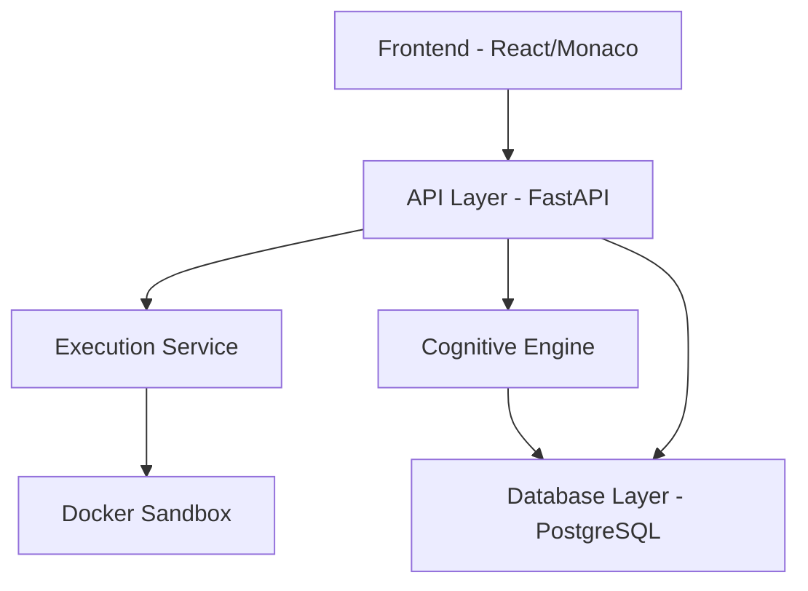

# Epic Brief — Beginner Cognitive Debugger

## Summary

The Beginner Cognitive Debugger is a web-based learning tool that helps novice Python programmers understand their errors by being guided through structured reflection rather than receiving immediate answers. The system executes Python code in an isolated Docker sandbox, classifies runtime and syntax errors against a predefined concept taxonomy, and forces learners to think before they receive help — through prediction prompts, reflection gates, and tiered hints. It is not a code runner. It is a pedagogical engine that uses the error as the teaching moment. The product is built as a modular monolith across three focused sprints, each producing a fully working vertical slice before the next begins.

---

## Context & Problem

### Who Is Affected
Beginner Python learners — students in introductory programming courses or self-taught learners in early stages — who frequently encounter runtime errors and immediately seek solutions without understanding the underlying concept failure. Instructors and tutors are indirect beneficiaries: the system handles the first layer of error guidance so human time is spent on deeper issues.

### The Problem
When beginners encounter a Python error, their reflex is to copy the traceback into a search engine or AI chat and get a fix. This short-circuits the cognitive process that produces actual learning. The learner fixes the symptom without internalising the concept — and makes the same mistake again. No existing tool enforces the reflection cycle: pause → hypothesise → attempt → reflect → hint → revise. Current debuggers (VS Code, PyCharm, Thonny) show errors but do not teach. Current AI tools (ChatGPT, Copilot) solve errors but do not teach.

### Where in the Product
This is a standalone greenfield product. There is no existing codebase. The entire system — backend, sandbox, cognitive engine, and frontend — is being built from scratch in three sprints.

---

## Sprint Roadmap

| Sprint | Theme | Deliverable |
|---|---|---|
| **Sprint 1** | Execution Spine | Safe Python execution, error capture, exception parsing, concept classification |
| **Sprint 2** | Cognitive Loop | Prediction toggle, reflection gate, tiered hints, re-execution restriction, solution gate |
| **Sprint 3** | Learning Brain | Error history, repeated concept detection, mastery engine, weakness profile, session persistence |

**Critical rule:** Each sprint delivers a fully working product. No partial infrastructure. Sprint 2 does not begin until Sprint 1 passes its success metric: 100 consecutive executions without crash or sandbox escape.

---

## Scope — Sprint 1 (Active)

**Included:**
- `POST /api/v1/execute` — validates Python code, returns structured execution result
- Docker-in-Docker sandbox — ephemeral container per request, 3s timeout, CPU/memory limits, no shell access
- Capture and store: `stdout`, `stderr`, `traceback`, `execution_time`, `success_flag`
- Exception parser — extracts type, message, and line number from traceback
- Hardcoded taxonomy classifier — maps 4 exception types to concept categories
- `GET /api/v1/health` — health check endpoint
- Anonymous sessions — `session_id` is a client-generated UUID, no auth
- Docker Compose for local orchestration (FastAPI backend + PostgreSQL + sandbox)
- Minimal React/Vite/Monaco frontend: code editor, run button, animated skeleton output panel, classified error display

**Explicitly excluded from Sprint 1:** hints, reflections, AI, analytics, authentication, teacher dashboard, session persistence.

---

## Technology Decisions (Frozen)

| Layer | Decision |
|---|---|
| Backend | FastAPI (Python, async, OpenAPI auto-docs) |
| Database | PostgreSQL + SQLAlchemy ORM + Alembic migrations |
| Sandbox | Docker-in-Docker — one ephemeral container per execution, destroyed after |
| Frontend | Vite + React + TypeScript + Tailwind CSS |
| Code Editor | Monaco Editor |
| Orchestration | Docker Compose (local development) |
| API versioning | `/api/v1/` — never broken; future changes go to `/api/v2/` |

---

## Architecture — Modular Monolith

Single deployable application with strict internal module boundaries. No module crosses into another's responsibility.

**Module boundary rule:** If any module crosses its responsibility boundary → architectural violation. Enforce this from Sprint 1.

---

## Core Entities (Sprint 1 Scope)

| Entity | Key Attributes |
|---|---|
| `CodeSubmission` | `id`, `code_text`, `session_id`, `timestamp` |
| `ExecutionResult` | `id`, `submission_id`, `stdout`, `stderr`, `traceback`, `execution_time`, `success_flag` |
| `ErrorRecord` | `id`, `execution_result_id`, `exception_type`, `concept_category` |
| `ConceptCategory` | `id`, `name`, `description`, `cognitive_skill` |

---

## Taxonomy — Sprint 1 Seed (4 mappings only)

| Exception Type | Concept Category | Cognitive Skill |
|---|---|---|
| `NameError` | Variable Initialization | State awareness |
| `TypeError` | Data Type Compatibility | Type reasoning |
| `IndexError` | List Management | Boundary reasoning |
| `KeyError` | Dictionary Usage | Mapping reasoning |

No expansion until real learner errors validate the need.

---

## Success Criteria — Sprint 1

- 100 consecutive executions without crash or sandbox escape
- Infinite loop terminated within 3 seconds
- Filesystem isolated — no access to host
- No shell access possible from sandbox
- Error classification correct for all 4 seeded exception types
- Empty/invalid code rejected at validation layer with correct error response