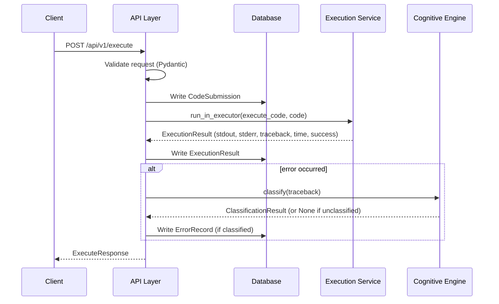
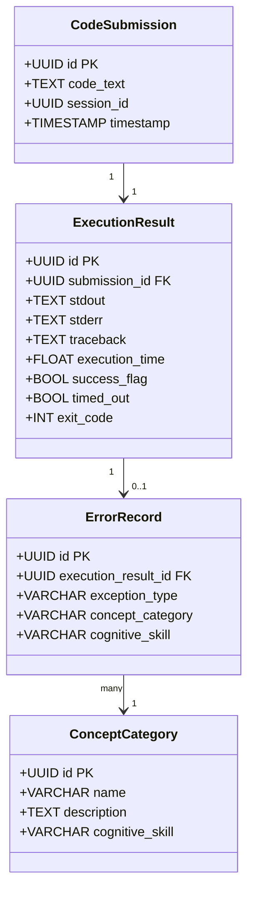
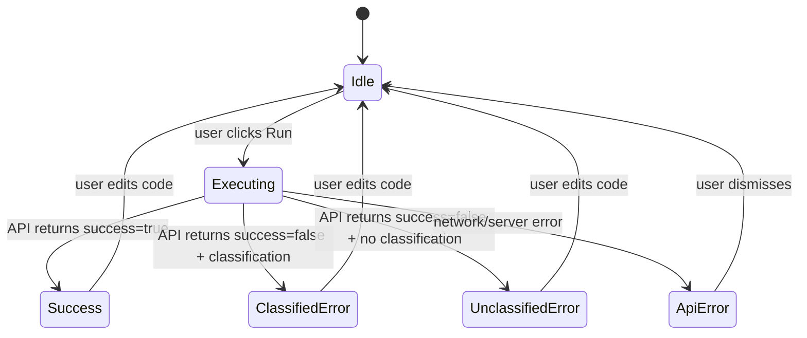

# Tech Plan — Sprint 1 — Beginner Cognitive Debugger

## Purpose

This document defines the complete internal technical design for Sprint 1 — the Execution Spine. It covers project layout, module responsibilities, internal APIs between modules, database schema, Docker topology, and the frontend API client generation pipeline. It is the authoritative implementation reference for Sprint 1. Sprints 2 and 3 extend this foundation without redesigning it.

---

## Locked Technical Decisions (Sprint 1)

| Decision | Choice |
|---|---|
| Docker connectivity | Socket bind-mount — `/var/run/docker.sock` mounted into backend container |
| Async execution strategy | Thread pool executor — `run_in_executor` wrapping synchronous `docker-py` calls |
| Cognitive Engine placement | API Layer orchestrates — route handler calls Execution Service → Cognitive Engine → DB in sequence |
| Database write strategy | Sequential writes — `CodeSubmission` on receipt, `ExecutionResult` after execution, `ErrorRecord` after classification |
| Frontend API communication | OpenAPI-generated typed client via `openapi-typescript` from FastAPI's `/openapi.json` |

---

## Project Structure

```
debugger/
├── backend/
│   ├── app/
│   │   ├── main.py                  # FastAPI app factory, router registration
│   │   ├── api/
│   │   │   └── v1/
│   │   │       ├── routes/
│   │   │       │   ├── execute.py   # POST /api/v1/execute route handler
│   │   │       │   └── health.py    # GET /api/v1/health route handler
│   │   │       └── schemas/
│   │   │           ├── execute.py   # Pydantic request/response models
│   │   │           └── health.py
│   │   ├── execution/
│   │   │   └── service.py           # Docker sandbox execution logic
│   │   ├── cognitive/
│   │   │   └── engine.py            # Exception parser + taxonomy classifier
│   │   ├── db/
│   │   │   ├── models.py            # SQLAlchemy ORM models
│   │   │   ├── session.py           # Database session factory
│   │   │   └── seed.py              # ConceptCategory taxonomy seed data
│   │   └── core/
│   │       └── config.py            # Environment-based configuration (pydantic-settings)
│   ├── alembic/                     # Alembic migrations
│   ├── Dockerfile
│   └── requirements.txt
├── frontend/
│   ├── src/
│   │   ├── api/
│   │   │   └── client.ts            # Auto-generated OpenAPI typed client
│   │   ├── components/
│   │   │   ├── Editor/
│   │   │   │   ├── EditorPanel.tsx  # Monaco editor wrapper
│   │   │   │   └── RunButton.tsx    # Run button with disabled/loading states
│   │   │   └── Output/
│   │   │       ├── OutputPanel.tsx  # Success output + error panel container
│   │   │       ├── SkeletonLoader.tsx
│   │   │       ├── SuccessOutput.tsx
│   │   │       ├── ClassifiedError.tsx   # Pedagogical signal first layout
│   │   │       └── UnclassifiedError.tsx # Fallback for unknown errors
│   │   ├── hooks/
│   │   │   └── useExecute.ts        # Execution state machine hook
│   │   ├── App.tsx
│   │   └── main.tsx
│   ├── package.json
│   ├── vite.config.ts
│   └── tsconfig.json
├── docker-compose.yml
└── .env.example
```

---

## Docker Compose Topology

```mermaid
graph TD
    HOST[Host Machine]
    COMPOSE[Docker Compose Network]
    FE[frontend :5173]
    API[backend :8000]
    DB[postgres :5432]
    SOCK[/var/run/docker.sock]
    SAND[sandbox container - ephemeral]

    HOST --> COMPOSE
    COMPOSE --> FE
    COMPOSE --> API
    COMPOSE --> DB
    HOST --> SOCK
    SOCK --> API
    API --> SAND
    SAND --> HOST
```

### Services

| Service | Image | Purpose |
|---|---|---|
| `backend` | Custom `Dockerfile` (Python 3.11) | FastAPI application |
| `postgres` | `postgres:15-alpine` | PostgreSQL database |
| `frontend` | Custom `Dockerfile` (Node 20) | Vite dev server |

### Socket bind-mount
The backend service in `docker-compose.yml` mounts the host Docker socket:
```
volumes:
  - /var/run/docker.sock:/var/run/docker.sock
```
This allows `docker-py` inside the backend container to spawn sibling containers on the host daemon — not nested child containers. The sandbox containers appear at the host level, not inside the backend container.

### Sandbox image
Pre-pull `python:3.11-slim` as part of Docker Compose startup to eliminate first-request cold start latency. The sandbox image is pinned — never `latest`.

### Resource limits enforced on each sandbox container

| Limit | Value |
|---|---|
| Execution timeout | 3 seconds (wall clock) |
| CPU | 0.5 cores (`nano_cpus`) |
| Memory | 64MB (`mem_limit`) |
| Network | Disabled (`network_mode: none`) |
| Read-only filesystem | Yes (`read_only: True`) |
| Privileged | False |
| User | Non-root (UID 1000) |

---

## Module Specifications

### 1. API Layer (`app/api/v1/routes/execute.py`)

**Responsibility:** Request validation, orchestration of Execution Service → Cognitive Engine → DB writes, response formatting.

**Must not:** Execute code, perform classification, contain business logic beyond orchestration.

#### Request Schema (`ExecuteRequest`)

| Field | Type | Validation |
|---|---|---|
| `code` | `str` | Required, non-empty, max 10 000 characters |
| `language` | `str` | Must equal `"python"` (MVP only) |
| `session_id` | `UUID` | Required (client-generated) |
| `prediction` | `str \| None` | Optional, max 1 000 characters |

#### Response Schema (`ExecuteResponse`)

```
{
  "status": "success" | "error",
  "data": {
    "submission_id": "uuid",
    "success": bool,
    "stdout": "...",
    "stderr": "...",
    "traceback": "...",
    "execution_time": 0.18,
    "classification": {              // null if success or unclassified
      "exception_type": "NameError",
      "concept_category": "Variable Initialization",
      "cognitive_skill": "State awareness"
    }
  },
  "message": ""
}
```

#### Orchestration Sequence



#### Error codes returned by the API layer

| Code | Condition |
|---|---|
| `VALIDATION_ERROR` | Empty code, oversized code, wrong language |
| `EXEC_TIMEOUT` | Sandbox exceeded 3s wall clock |
| `EXEC_RESOURCE_LIMIT` | Container OOM killed |
| `EXEC_FAILED` | Docker daemon error — container could not start |
| `INTERNAL_ERROR` | Unexpected server-side failure |

---

### 2. Execution Service (`app/execution/service.py`)

**Responsibility:** Spawn an ephemeral Docker container, run the submitted code inside it, capture all output, enforce resource limits, return raw result.

**Must not:** Classify errors, write to the database, make routing decisions.

#### Function signature
`execute_code(code: str) -> ExecutionResult`

This is a **synchronous** function called via `run_in_executor` from the async route handler.

#### Execution procedure

1. Create a temporary directory (host-side) and write `submission.py` to it
2. Call `docker_client.containers.run()` with:
   - Image: `python:3.11-slim`
   - Command: `python /code/submission.py`
   - Volume: temp directory mounted read-only at `/code`
   - `mem_limit="64m"`, `nano_cpus=500_000_000`
   - `network_disabled=True`, `read_only=True`
   - `user="1000"`, `privileged=False`
   - `remove=True` (auto-destroy after exit)
3. Apply wall-clock timeout of 3s via `docker-py`'s `timeout` parameter
4. Capture `stdout` (from container logs), `stderr`, `exit_code`
5. Clean up temp directory
6. Return structured `ExecutionResult`

#### Return structure (`ExecutionResult` dataclass)

| Field | Type | Notes |
|---|---|---|
| `stdout` | `str` | Empty string if no output |
| `stderr` | `str` | Empty string if no error output |
| `traceback` | `str` | Full Python traceback string if error; empty if success |
| `exit_code` | `int` | 0 = success, non-zero = error |
| `execution_time` | `float` | Wall-clock seconds, measured by service |
| `success` | `bool` | `exit_code == 0` |
| `timed_out` | `bool` | `True` if 3s wall clock exceeded |

---

### 3. Cognitive Engine (`app/cognitive/engine.py`)

**Responsibility:** Parse exception type from traceback string; map to `ConceptCategory` using the taxonomy; return a structured classification or `None` if unclassified.

**Must not:** Access the database, make network calls, generate hints (Sprint 2), use AI (Sprint 4+).

#### Function signatures

`parse_exception(traceback: str) -> ParsedError | None`

`classify(traceback: str) -> ClassificationResult | None`

#### Exception parsing logic

The parser reads the last line of the traceback string, which follows the Python standard format:
`ExceptionType: message`

It also extracts the line number from the `File "...", line N` pattern earlier in the traceback.

#### Taxonomy mapping table (in-process, no DB query at runtime)

The taxonomy is loaded once at application startup from the database seed and cached in memory as a plain dict:

```
{
  "NameError": ClassificationResult(concept="Variable Initialization", skill="State awareness"),
  "TypeError": ClassificationResult(concept="Data Type Compatibility", skill="Type reasoning"),
  "IndexError": ClassificationResult(concept="List Management", skill="Boundary reasoning"),
  "KeyError":   ClassificationResult(concept="Dictionary Usage", skill="Mapping reasoning"),
}
```

If the exception type is not in this dict → return `None`. The API layer handles the unclassified fallback.

#### `ClassificationResult` dataclass

| Field | Type |
|---|---|
| `exception_type` | `str` |
| `concept_category` | `str` |
| `cognitive_skill` | `str` |

---

### 4. Database Layer (`app/db/`)

**Responsibility:** ORM model definitions, session factory, migration management, taxonomy seed data.

**Must not:** Contain business logic, orchestration, or classification.

#### PostgreSQL Schema



#### Sequential write order and failure behaviour

| Step | Write | Failure behaviour |
|---|---|---|
| 1 | `CodeSubmission` | Request returns `INTERNAL_ERROR`. No orphaned records. |
| 2 | `ExecutionResult` | `CodeSubmission` exists with no linked result. Acceptable for MVP. Logged as warning. |
| 3 | `ErrorRecord` | `ExecutionResult` exists with no classification. API returns unclassified response to frontend. Logged as warning. |

No transaction wrapping across steps. Each write uses its own session commit. This is the agreed approach — partial records are tolerated and logged for Sprint 1.

#### Alembic migration strategy

- Single initial migration for Sprint 1: creates all four tables
- Seed migration: inserts 4 `ConceptCategory` rows
- All migrations version-controlled alongside schema changes in Sprint 2 and 3

#### Session factory

Async SQLAlchemy session via `asyncpg` driver (`postgresql+asyncpg://`). Sessions injected as FastAPI dependencies using `Depends(get_db)`.

---

### 5. Frontend Module Design

**Responsibility:** Code editor, run button with states, animated skeleton output panel, classified/unclassified error display, session_id generation.

**Must not:** Execute code, perform classification, contain business logic.

#### OpenAPI client generation pipeline

1. FastAPI auto-generates `/openapi.json` at startup
2. `package.json` script: `"generate:api": "openapi-typescript http://localhost:8000/openapi.json -o src/api/client.ts"`
3. Run once after every backend schema change — commits generated `client.ts` to version control
4. All frontend fetch calls use types from `client.ts` — no manual type duplication

#### State machine for execution (`useExecute` hook)



#### `session_id` management

Generated once via `crypto.randomUUID()` on app load. Stored in `localStorage` under key `debugger_session_id`. Sent with every `POST /api/v1/execute` request. Persists across page refreshes. Sprint 3 resume logic reads from the same key.

#### Component responsibilities

| Component | Responsibility |
|---|---|
| `EditorPanel` | Monaco editor instance, Python syntax highlighting, value state |
| `RunButton` | Enabled/disabled based on `isExecuting`; shows spinner while executing |
| `SkeletonLoader` | Animated placeholder shown in output panel during execution |
| `SuccessOutput` | Renders `stdout` in green-tinted panel |
| `ClassifiedError` | Concept category banner (prominent, top), collapsible raw traceback below |
| `UnclassifiedError` | Raw traceback + "This error type isn't in our system yet. Read the traceback carefully." prompt |
| `OutputPanel` | Switches between `SkeletonLoader`, `SuccessOutput`, `ClassifiedError`, `UnclassifiedError` based on state |

#### Editor View Wireframe

```wireframe
<!DOCTYPE html>
<html>
<head>
<style>
  * { box-sizing: border-box; margin: 0; padding: 0; font-family: system-ui, sans-serif; }
  body { background: #f8f9fa; min-height: 100vh; }
  .topnav { background: #1e1e2e; color: #cdd6f4; display: flex; align-items: center; justify-content: space-between; padding: 0 24px; height: 48px; }
  .topnav .brand { font-weight: 700; font-size: 15px; letter-spacing: 0.5px; }
  .topnav nav { display: flex; gap: 4px; }
  .topnav nav a { color: #cdd6f4; text-decoration: none; padding: 6px 14px; border-radius: 6px; font-size: 13px; }
  .topnav nav a.active { background: #313244; }
  .workspace { display: grid; grid-template-columns: 1fr 1fr; gap: 0; height: calc(100vh - 48px); }
  .pane { display: flex; flex-direction: column; }
  .pane-header { background: #181825; color: #a6adc8; font-size: 12px; font-weight: 600; padding: 10px 16px; border-bottom: 1px solid #313244; display: flex; align-items: center; justify-content: space-between; letter-spacing: 0.5px; text-transform: uppercase; }
  .editor-area { flex: 1; background: #1e1e2e; color: #cdd6f4; font-family: 'Courier New', monospace; font-size: 13px; padding: 16px; line-height: 1.6; overflow: auto; }
  .line-numbers { color: #585b70; margin-right: 16px; user-select: none; }
  .editor-toolbar { background: #181825; border-top: 1px solid #313244; padding: 10px 16px; display: flex; align-items: center; justify-content: space-between; }
  .run-btn { background: #a6e3a1; color: #1e1e2e; border: none; border-radius: 6px; padding: 8px 22px; font-weight: 700; font-size: 14px; cursor: pointer; display: flex; align-items: center; gap: 8px; }
  .run-btn:disabled { background: #45475a; color: #585b70; cursor: not-allowed; }
  .output-pane { background: #181825; border-left: 1px solid #313244; }
  .output-area { flex: 1; padding: 16px; overflow: auto; }
  .output-placeholder { color: #585b70; font-size: 13px; text-align: center; margin-top: 60px; }

  /* Skeleton loader */
  .skeleton-block { background: #313244; border-radius: 6px; height: 14px; margin-bottom: 10px; animation: pulse 1.5s ease-in-out infinite; }
  .skeleton-block.short { width: 40%; }
  .skeleton-block.medium { width: 70%; }
  .skeleton-block.long { width: 90%; }
  @keyframes pulse { 0%,100% { opacity: 1; } 50% { opacity: 0.4; } }

  /* Success output */
  .success-output { background: #1e3a2e; border: 1px solid #a6e3a1; border-radius: 8px; padding: 14px 16px; }
  .success-label { color: #a6e3a1; font-size: 11px; font-weight: 700; text-transform: uppercase; letter-spacing: 0.8px; margin-bottom: 8px; }
  .success-text { color: #cdd6f4; font-family: monospace; font-size: 13px; }

  /* Classified error */
  .concept-banner { background: #2d1b3d; border: 1px solid #cba6f7; border-radius: 8px; padding: 14px 16px; margin-bottom: 12px; }
  .concept-type { color: #cba6f7; font-size: 11px; font-weight: 700; text-transform: uppercase; letter-spacing: 0.8px; margin-bottom: 4px; }
  .concept-name { color: #f5c2e7; font-size: 18px; font-weight: 700; }
  .concept-skill { color: #a6adc8; font-size: 12px; margin-top: 4px; }
  .traceback-toggle { color: #585b70; font-size: 12px; cursor: pointer; padding: 6px 0; display: flex; align-items: center; gap: 6px; border: none; background: none; }
  .traceback-block { background: #11111b; border: 1px solid #313244; border-radius: 6px; padding: 12px; font-family: monospace; font-size: 12px; color: #f38ba8; line-height: 1.5; margin-top: 6px; }

  /* Unclassified error */
  .unclassified-banner { background: #2a1f1f; border: 1px solid #f38ba8; border-radius: 8px; padding: 14px 16px; margin-bottom: 12px; }
  .unclassified-label { color: #f38ba8; font-size: 11px; font-weight: 700; text-transform: uppercase; letter-spacing: 0.8px; margin-bottom: 6px; }
  .unclassified-prompt { color: #a6adc8; font-size: 13px; }

  .tab-row { display: flex; gap: 2px; padding: 8px 16px 0; }
  .tab { padding: 6px 14px; font-size: 12px; font-weight: 600; border-radius: 6px 6px 0 0; cursor: pointer; color: #585b70; background: transparent; border: none; }
  .tab.active { color: #cdd6f4; background: #181825; }
</style>
</head>
<body>
<div class="topnav">
  <span class="brand">⬡ Cognitive Debugger</span>
  <nav>
    <a href="#" class="active">Editor</a>
    <a href="#">My Progress</a>
  </nav>
</div>

<div class="workspace">
  <!-- LEFT: Editor pane -->
  <div class="pane">
    <div class="pane-header">
      <span>Python Editor</span>
      <span style="color:#585b70; font-size:11px;">session: anon-7f3a…</span>
    </div>
    <div class="editor-area">
      <span class="line-numbers">1</span><span style="color:#cba6f7;">def</span> <span style="color:#89b4fa;">greet</span>(name):<br>
      <span class="line-numbers">2</span>&nbsp;&nbsp;&nbsp;&nbsp;<span style="color:#89b4fa;">print</span>(<span style="color:#a6e3a1;">"Hello, "</span> + msg)<br>
      <span class="line-numbers">3</span><br>
      <span class="line-numbers">4</span><span style="color:#89b4fa;">greet</span>(<span style="color:#a6e3a1;">"world"</span>)<br>
    </div>
    <div class="editor-toolbar">
      <span style="color:#585b70; font-size:12px;">Python 3.11</span>
      <button class="run-btn" data-element-id="run-button">▶ Run Code</button>
    </div>
  </div>

  <!-- RIGHT: Output pane — showing 3 states as stacked sections for demo -->
  <div class="pane output-pane">
    <div class="pane-header">Output</div>

    <div class="tab-row">
      <button class="tab active">Executing…</button>
      <button class="tab">Error (Classified)</button>
      <button class="tab">Error (Unclassified)</button>
      <button class="tab">Success</button>
    </div>

    <div class="output-area">

      <!-- STATE 1: Skeleton loading -->
      <div style="margin-bottom:28px;">
        <div style="color:#585b70; font-size:11px; text-transform:uppercase; letter-spacing:0.6px; margin-bottom:10px;">Executing…</div>
        <div class="skeleton-block long"></div>
        <div class="skeleton-block medium"></div>
        <div class="skeleton-block short"></div>
        <div class="skeleton-block long"></div>
        <div class="skeleton-block medium"></div>
      </div>

      <hr style="border-color:#313244; margin-bottom:20px;">

      <!-- STATE 2: Classified error -->
      <div style="margin-bottom:28px;">
        <div class="concept-banner">
          <div class="concept-type">NameError · Variable Initialization</div>
          <div class="concept-name">Variable Initialization Error</div>
          <div class="concept-skill">Skill gap: State awareness</div>
        </div>
        <button class="traceback-toggle" data-element-id="traceback-toggle">▶ Show raw traceback</button>
        <div class="traceback-block" style="display:none;">
Traceback (most recent call last):
  File "/code/submission.py", line 4, in &lt;module&gt;
    greet("world")
  File "/code/submission.py", line 2, in greet
    print("Hello, " + msg)
NameError: name 'msg' is not defined
        </div>
      </div>

      <hr style="border-color:#313244; margin-bottom:20px;">

      <!-- STATE 3: Unclassified error -->
      <div style="margin-bottom:28px;">
        <div class="unclassified-banner">
          <div class="unclassified-label">Unrecognised Error</div>
          <div class="unclassified-prompt">This error type isn't in our system yet. Read the traceback carefully.</div>
        </div>
        <div class="traceback-block">
Traceback (most recent call last):
  File "/code/submission.py", line 2, in &lt;module&gt;
    x = 1 / 0
ZeroDivisionError: division by zero
        </div>
      </div>

      <hr style="border-color:#313244; margin-bottom:20px;">

      <!-- STATE 4: Success -->
      <div class="success-output">
        <div class="success-label">✓ Executed in 0.14s</div>
        <div class="success-text">Hello, world</div>
      </div>

    </div>
  </div>
</div>
</body>
</html>
```

---

## Environment Configuration (`core/config.py`)

All values loaded from environment variables via `pydantic-settings`. No hardcoded values in source.

| Variable | Default | Description |
|---|---|---|
| `DATABASE_URL` | — | PostgreSQL connection string (asyncpg driver) |
| `SANDBOX_IMAGE` | `python:3.11-slim` | Docker image for sandbox containers |
| `SANDBOX_TIMEOUT_SECONDS` | `3` | Wall-clock execution timeout |
| `SANDBOX_MEM_LIMIT` | `64m` | Container memory limit |
| `SANDBOX_CPU_QUOTA` | `500000000` | `nano_cpus` value (0.5 cores) |
| `MAX_CODE_LENGTH` | `10000` | Max characters accepted in `code` field |

---

## API Contract — Sprint 1 Endpoints

### `POST /api/v1/execute`

**Request:**
```
POST /api/v1/execute
Content-Type: application/json

{
  "code": "print(x)",
  "language": "python",
  "session_id": "550e8400-e29b-41d4-a716-446655440000",
  "prediction": null
}
```

**Response (classified error):**
```
{
  "status": "error",
  "data": {
    "submission_id": "uuid",
    "success": false,
    "stdout": "",
    "stderr": "",
    "traceback": "Traceback...\nNameError: name 'x' is not defined",
    "execution_time": 0.18,
    "classification": {
      "exception_type": "NameError",
      "concept_category": "Variable Initialization",
      "cognitive_skill": "State awareness"
    }
  },
  "message": "NameError detected"
}
```

**Response (unclassified error):**
```
{
  "status": "error",
  "data": {
    "submission_id": "uuid",
    "success": false,
    "stdout": "",
    "stderr": "",
    "traceback": "Traceback...\nZeroDivisionError: division by zero",
    "execution_time": 0.11,
    "classification": null
  },
  "message": "Unclassified error"
}
```

**Response (timeout):**
```
{
  "status": "error",
  "data": null,
  "message": "Execution timeout",
  "code": "EXEC_TIMEOUT"
}
```

### `GET /api/v1/health`

```
{
  "status": "ok"
}
```

---

## Module Boundary Enforcement Rules

These rules are permanent. Any violation is an architectural regression, not a refactoring opportunity.

| Rule | Description |
|---|---|
| Execution Service has no DB import | `app/execution/service.py` must never import from `app/db` |
| Cognitive Engine has no DB import | `app/cognitive/engine.py` must never import from `app/db` |
| Cognitive Engine has no Execution import | `app/cognitive/engine.py` must never import from `app/execution` |
| API routes own all orchestration | No module calls another module except through the API route handler |
| Frontend has no execution logic | All API calls go through `src/api/client.ts` — no `fetch` calls in components |

---

## Sprint 1 Success Criteria (Technical)

| Criterion | Verification |
|---|---|
| 100 consecutive executions without crash or sandbox escape | Automated test script: 100 concurrent and sequential requests |
| Infinite loop terminated within 3 seconds | Submit `while True: pass` — response within 3.5s |
| No shell access from sandbox | `import os; os.system("ls /")` returns error, not directory listing |
| No host filesystem access | `open("/etc/passwd")` raises `FileNotFoundError` |
| Memory limit enforced | Allocating 128MB list raises OOM — container killed, `EXEC_RESOURCE_LIMIT` returned |
| All 4 taxonomy classifications correct | Unit tests for each of the 4 exception types |
| Empty code rejected | `POST /execute` with `code: ""` returns `VALIDATION_ERROR` |

---

## What This Plan Does NOT Include (Sprint 2+)

| Feature | Sprint |
|---|---|
| Prediction toggle UI and comparison | Sprint 2 |
| Reflection gate and input form | Sprint 2 |
| Hint tier system (3 tiers) | Sprint 2 |
| Re-execution restriction (FR14) | Sprint 2 |
| Solution gate (3-confirmation) | Sprint 2 |
| Error history storage | Sprint 3 |
| Concept mastery engine | Sprint 3 |
| Session persistence + resume | Sprint 3 |
| Analytics dashboard | Sprint 3 |
| Authentication | Post-Sprint 3 |
| AI/LLM integration | Sprint 4+ |