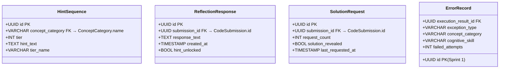
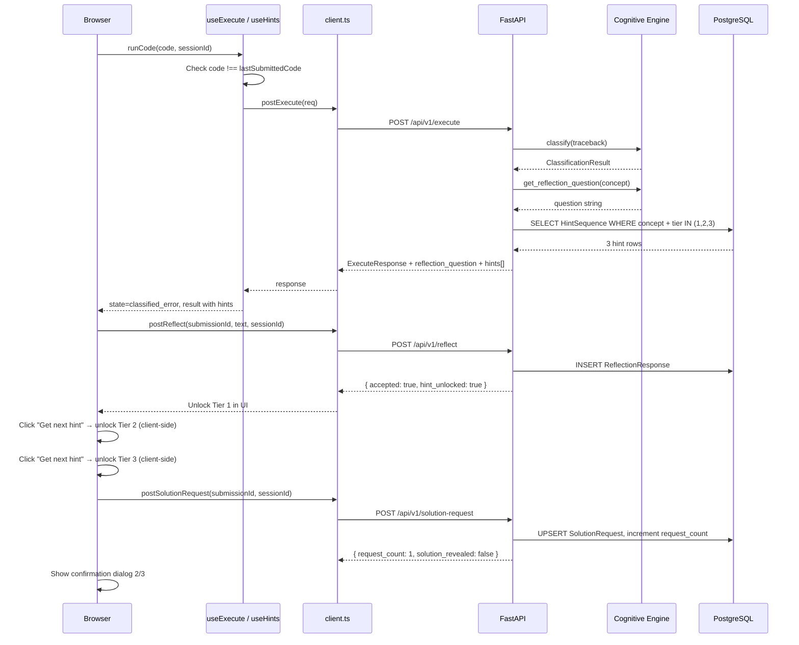

# Tech Plan — Sprint 2 — Beginner Cognitive Debugger

## Purpose

This document defines the complete internal technical design for Sprint 2 — the Cognitive Loop. It extends the Sprint 1 execution spine without redesigning any of it. Sprint 2 adds five user-facing flows (F4–F8): prediction toggle, reflection gate, three-tier hint system, re-execution restriction, and the solution gate. All additions are additive — no Sprint 1 module is broken or restructured.

---

## Sprint 2 Scope Summary

| Flow | Feature | Key Mechanism |
|---|---|---|
| F4 | Prediction Toggle | Optional textarea stored as `prediction` in `CodeSubmission`; comparison note in output panel |
| F5 | Reflection Gate | Guided question (rule-based from concept); `ReflectionResponse` DB record; unlocks Tier 1 hint |
| F6 | Hint Tier Progression | `HintSequence` DB table (pre-written per concept); three locked tiers, progressively unlocked |
| F7 | Re-execution Restriction | Frontend-only: code diff check before submitting; blocks identical re-runs |
| F8 | Solution Gate | `SolutionRequest` counter per `CodeSubmission`; three-confirmation modal sequence |

**Explicitly excluded from Sprint 2:** session persistence, analytics dashboard, mastery engine, authentication, AI-generated hints (Sprint 3+).

---

## Locked Technical Decisions (Sprint 2)

| Decision | Choice |
|---|---|
| Hint storage | Pre-written hints stored in `HintSequence` DB table, seeded at startup — no LLM, no generation |
| Reflection questions | Rule-based mapping: `concept_category → question text`, defined as a Python dict in the Cognitive Engine |
| Re-execution check | Frontend-only (hash comparison in `useExecute` hook) — no backend change required |
| Solution gate counter | Stored in a new `SolutionRequest` DB table, incremented via `POST /api/v1/execute/:submission_id/solution-request` |
| Hint unlock tracking | Client-side state for Tier 2/3 unlock (click-to-unlock); Tier 1 unlocks via reflection submission or auto-unlock after 2 failed resubmissions |
| Auto-unlock tracking | Server-side: `ErrorRecord` tracks `failed_attempts` count; auto-unlock fires when count reaches 2 |

---

## New Database Tables (Sprint 2)



**`ErrorRecord.failed_attempts`** — new column added via Alembic migration. Incremented each time the same `session_id` gets a new classified error in the same concept category. When `failed_attempts >= 2`, auto-unlock fires for Tier 1.

**`HintSequence`** — seeded at startup with 3 hint rows per concept category × 4 categories = 12 rows total. Tier values: 1 (Concept), 2 (Directional), 3 (Near-Solution).

---

## Module Responsibilities (Sprint 2 Additions)

### 1. Cognitive Engine Extension (`app/cognitive/engine.py`)

**New responsibility:** Generate the guided reflective question for a given concept category.

`get_reflection_question(concept_category: str) -> str`

Returns a pre-written question string from an in-module dict keyed by concept category. No DB call. No network. Returns a generic fallback if concept not found.

**Module boundary:** Still zero imports from `app/db`, `app/execution`, or `app/api`.

Reflection question mapping (hardcoded in `engine.py`):

| Concept Category | Guided Question |
|---|---|
| Variable Initialization | "Where in your code should the variable have been created before it was used?" |
| Data Type Compatibility | "What types of values are you trying to combine, and do they work together in Python?" |
| List Management | "What is the length of your list, and which index are you trying to access?" |
| Dictionary Usage | "What keys does your dictionary actually contain, and which one were you trying to access?" |

### 2. API Layer — New Endpoints

#### `POST /api/v1/reflect`

**Request:**

| Field | Type | Validation |
|---|---|---|
| `submission_id` | `UUID` | Required, must exist |
| `response_text` | `str` | Required, min 1 char, max 2000 chars |
| `session_id` | `UUID` | Required |

**Orchestration:**
1. Look up the `CodeSubmission` by `submission_id` — 404 if not found.
2. Look up the linked `ErrorRecord` — 404 if not found (no error to reflect on).
3. Write `ReflectionResponse` with `hint_unlocked=True`.
4. Update `ErrorRecord.failed_attempts` is not relevant here (reflection submission unlocks immediately).
5. Return `{ accepted: true, hint_unlocked: true, reflection_id: uuid }`.

#### `POST /api/v1/hint`

**Request:**

| Field | Type | Validation |
|---|---|---|
| `submission_id` | `UUID` | Required |
| `tier` | `int` | 1, 2, or 3 |
| `session_id` | `UUID` | Required |

**Orchestration:**
1. Look up `ErrorRecord` linked to this `submission_id`'s `ExecutionResult`.
2. Look up `HintSequence` for `concept_category` + `tier`.
3. Return the hint text.

**No write.** Hint retrieval is read-only. Tier access is trusted (frontend enforces unlock sequence). This endpoint exists to fetch hint content by tier without embedding it in the execute response.

#### `POST /api/v1/solution-request`

**Request:**

| Field | Type | Validation |
|---|---|---|
| `submission_id` | `UUID` | Required |
| `session_id` | `UUID` | Required |

**Orchestration:**
1. Upsert `SolutionRequest` for this `submission_id` — increment `request_count`.
2. If `request_count >= 3`, set `solution_revealed=True` and return the solution (fetched from the `HintSequence` Tier 3 text as the proxy for now — Sprint 4 will add AI-generated solutions).
3. Return `{ request_count, solution_revealed, solution_text | null }`.

---

## API Schema Changes to `/api/v1/execute` Response

The `ExecuteResponse` is extended — no breaking changes. The `data` object gains two new optional fields:

```
"data": {
  ...existing Sprint 1 fields...,
  "reflection_question": "Where in your code should the variable have been created?",  // null if no classification
  "hints": [
    { "tier": 1, "tier_name": "Concept", "hint_text": "Check where variables are defined before use.", "unlocked": false },
    { "tier": 2, "tier_name": "Directional", "hint_text": "Initialize the variable before calling print().", "unlocked": false },
    { "tier": 3, "tier_name": "Near-Solution", "hint_text": "You need to assign a value to x on a line before print(x).", "unlocked": false }
  ]  // null if no classification
}
```

The execute route handler, when a classified error occurs:
1. Calls `get_reflection_question(concept_category)` from the Cognitive Engine.
2. Queries `HintSequence` for all 3 tiers of the matched concept.
3. Appends both to the response. Hints are always returned locked (`unlocked: false`) — unlock state is managed client-side or via the `/reflect` and auto-unlock flow.

---

## Frontend State Machine Extension

The existing `useExecute` state machine gains two new concepts:

**Re-execution restriction (F7):**
- Hook stores `lastSubmittedCode: string | null`.
- Before calling `postExecute`, if `code === lastSubmittedCode` → set a new local `sameCode` boolean; do not call the API; display inline message.
- `lastSubmittedCode` updates only on successful API call.

**Extended state shape:**

```
type ExecuteState = "idle" | "executing" | "success" | "classified_error" | "unclassified_error" | "api_error"
```
No new states — `classified_error` now also carries `reflection_question` and `hints[]` in the `result` object.

**Hint unlock state** is managed in a separate `useHints` hook (or local state in `ClassifiedError` component):
- `unlockedTiers: Set<1|2|3>` — starts empty.
- Tier 1 unlocks when: `ReflectionResponse` is submitted successfully OR auto-unlock fires (`failed_attempts >= 2` returned from any subsequent execute call).
- Tier 2 unlocks when user clicks "Get next hint" after Tier 1 is visible.
- Tier 3 unlocks when user clicks "Get next hint" after Tier 2 is visible.

**Solution gate state** lives in `ClassifiedError` or a dedicated `useSolutionGate` hook:
- `requestCount: 0 | 1 | 2 | 3` — tracks how many confirmations have been made.
- At `requestCount === 3`, solution text is rendered.

---

## Alembic Migration Strategy (Sprint 2)

Single new migration: `002_sprint2_cognitive_loop.py`

Changes:
1. Create `hint_sequences` table.
2. Create `reflection_responses` table.
3. Create `solution_requests` table.
4. Add `failed_attempts` column (INTEGER, default 0) to `error_records`.

Seed additions (run in `main.py` lifespan alongside existing seed):
- `run_hint_seed(db)` — inserts 12 `HintSequence` rows (3 tiers × 4 concept categories).

---

## Hint Seed Data

| Concept Category | Tier | Tier Name | Hint Text |
|---|---|---|---|
| Variable Initialization | 1 | Concept | "Check where variables are defined before use." |
| Variable Initialization | 2 | Directional | "Initialize the variable before the line that uses it." |
| Variable Initialization | 3 | Near-Solution | "You need to assign a value to the variable on a line before you reference it." |
| Data Type Compatibility | 1 | Concept | "Check the types of the values you are combining." |
| Data Type Compatibility | 2 | Directional | "Python cannot add a string and an integer directly — convert one first." |
| Data Type Compatibility | 3 | Near-Solution | "Use `str()` or `int()` to convert one value to match the other's type." |
| List Management | 1 | Concept | "Check the valid index range for your list before accessing it." |
| List Management | 2 | Directional | "List indices start at 0 — the last valid index is `len(list) - 1`." |
| List Management | 3 | Near-Solution | "Your list has fewer items than the index you are using. Check the list length first." |
| Dictionary Usage | 1 | Concept | "Check which keys actually exist in your dictionary before accessing them." |
| Dictionary Usage | 2 | Directional | "Use `in` to check if a key exists before accessing it, or use `.get()` with a default." |
| Dictionary Usage | 3 | Near-Solution | "The key you are accessing was never added to the dictionary. Print the dictionary to see its actual contents." |

---

## Project Structure Additions (Sprint 2)

```
backend/
└── app/
    ├── api/
    │   └── v1/
    │       ├── routes/
    │       │   ├── reflect.py          # POST /api/v1/reflect
    │       │   ├── hint.py             # POST /api/v1/hint
    │       │   └── solution.py         # POST /api/v1/solution-request
    │       └── schemas/
    │           ├── reflect.py          # ReflectRequest / ReflectResponse
    │           ├── hint.py             # HintRequest / HintResponse
    │           └── solution.py         # SolutionRequest / SolutionResponse
    ├── cognitive/
    │   └── engine.py                   # + get_reflection_question()
    └── db/
        ├── models.py                   # + HintSequence, ReflectionResponse, SolutionRequest models; ErrorRecord.failed_attempts
        └── seed.py                     # + run_hint_seed()

alembic/
└── versions/
    └── 002_sprint2_cognitive_loop.py   # New migration

frontend/
└── src/
    ├── hooks/
    │   └── useExecute.ts               # + re-execution restriction logic
    ├── components/
    │   └── Output/
    │       ├── ClassifiedError.tsx     # Major extension: reflection gate + hint tiers + solution gate
    │       └── ReflectionGate.tsx      # NEW: reflection textarea + submit
    │       └── HintTiers.tsx           # NEW: 3-tier hint panel
    │       └── SolutionGate.tsx        # NEW: "Show Solution" button + 3-confirmation modal
    └── api/
        └── client.ts                   # + postReflect(), postHint(), postSolutionRequest()
```

---

## Full Sprint 2 Request Flow



---

## Module Boundary Rules (Sprint 2 — Permanent)

All Sprint 1 module boundary rules remain in force. Sprint 2 additions:

| Rule | Description |
|---|---|
| `reflect.py`, `hint.py`, `solution.py` routes own all orchestration | No cross-module calls outside route handlers |
| Cognitive Engine — no DB in `get_reflection_question` | Question text is an in-module constant, no DB lookup |
| `HintSequence` fetch is API-layer responsibility | Route handlers query DB for hints; Cognitive Engine does not |
| Frontend hint unlock state is client-local | No backend endpoint required for Tier 2/3 unlock clicks |

---

## Sprint 2 Success Criteria (Technical)

| Criterion | Verification |
|---|---|
| `POST /execute` classified response includes `reflection_question` and `hints[]` | Manual test: submit `print(x)` → response JSON contains both fields |
| `POST /reflect` creates `ReflectionResponse` row in DB | Check DB after submission |
| All 3 hint tiers render correctly in UI (locked/unlocked states) | Visual verification: Tier 1 locked initially, unlocks after reflection |
| Re-execution block fires for identical code | Submit same code twice → inline message shown, no API call made |
| Solution gate requires 3 confirmations | Click "Show Solution" three times → solution renders only after third |
| `failed_attempts` auto-unlock fires at 2 | Submit 2 errors with same session → Tier 1 unlocks without reflection |
| Prediction stored when toggle is ON and text is present | DB check: `CodeSubmission.prediction` is non-null |
| Prediction comparison note renders in output panel | Visual verification |

---

## What This Plan Does NOT Include (Sprint 3)

| Feature | Sprint |
|---|---|
| Session resume dialog | Sprint 3 |
| Learning analytics dashboard | Sprint 3 |
| Concept mastery engine | Sprint 3 |
| Error history storage | Sprint 3 |
| AI-generated hints or questions | Sprint 4+ |